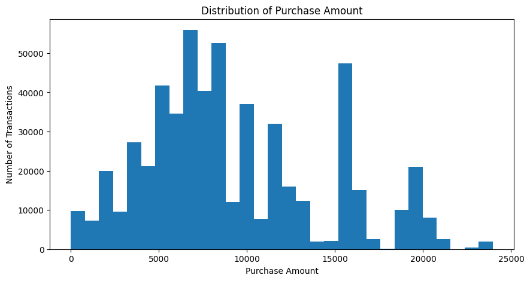
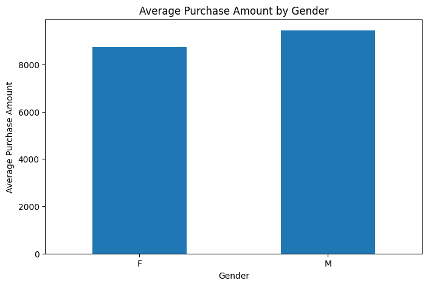
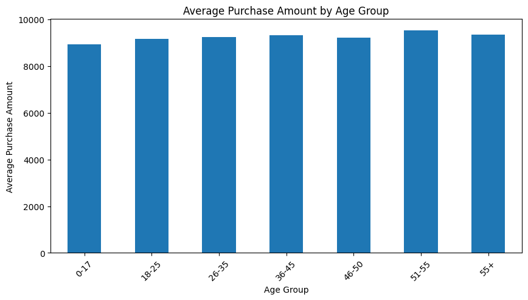
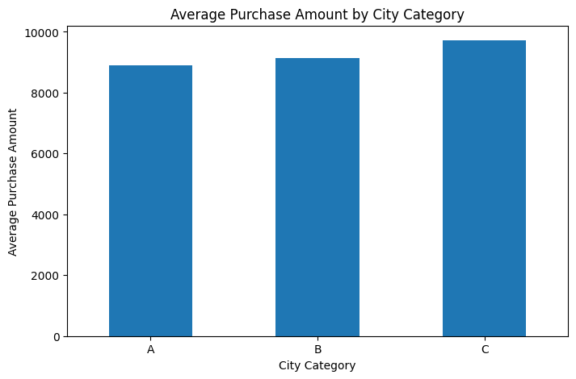
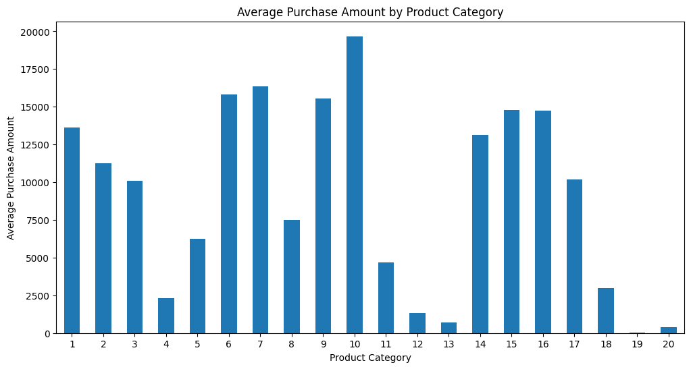
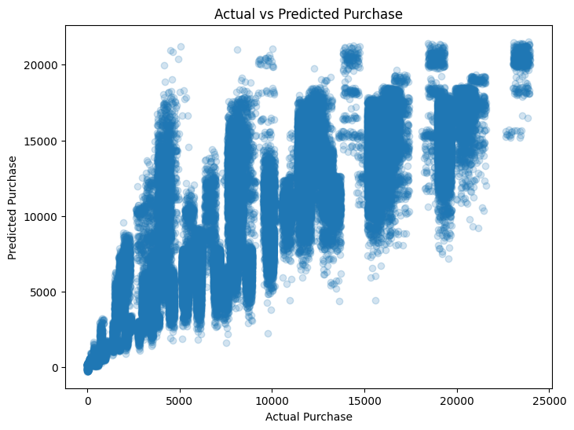
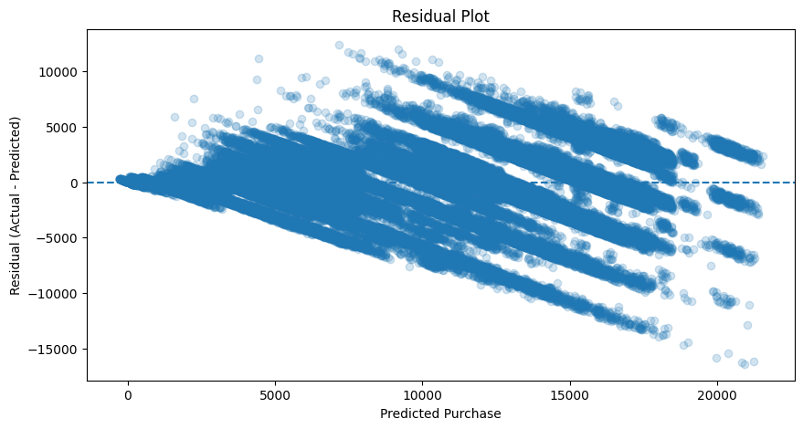

# 🛍️ Black Friday Customer Purchase Analysis & Prediction

## 📌 Project Overview

This project analyzes customer purchase behavior using the Black Friday sales dataset and builds machine learning models to predict purchase amounts.

The project includes:

- Exploratory Data Analysis (EDA)
- Customer purchase behavior analysis
- Data preprocessing
- Feature encoding
- Regression machine learning
- Model evaluation
- Actual vs predicted analysis
- Residual analysis

---

## 📂 Dataset

The dataset contains **550,068 transactions** and **12 columns**.

### Features

| Feature | Description |
|---|---|
| User_ID | Unique customer identifier |
| Product_ID | Unique product identifier |
| Gender | Customer gender |
| Age | Customer age group |
| Occupation | Occupation category |
| City_Category | City category |
| Stay_In_Current_City_Years | Years stayed in current city |
| Marital_Status | Marital status |
| Product_Category_1 | Primary product category |
| Product_Category_2 | Secondary product category |
| Product_Category_3 | Tertiary product category |
| Purchase | Purchase amount — target variable |

---

## 🔍 Exploratory Data Analysis

### Purchase Distribution



The distribution shows the spread of purchase amounts across the transactions.

### Average Purchase by Gender



This chart compares the average purchase amount across genders.

### Average Purchase by Age



This chart compares average purchase amounts across different age groups.

### Average Purchase by City



This chart compares average purchase amounts across the three city categories.

### Average Purchase by Product Category



This chart compares average purchase amounts across Product Category 1.

---

## 🤖 Machine Learning

### Target Variable

The target variable is:

`Purchase`

### Preprocessing

- Missing values in `Product_Category_2` and `Product_Category_3` were filled with `0`.
- `User_ID` was removed because it is an identifier.
- Categorical variables were encoded using One-Hot Encoding.
- Product category variables were treated as categorical features.
- The dataset was split into training and testing sets using an 80/20 split.

### Train-Test Split

- Training samples: **440,054**
- Testing samples: **110,014**

---

## 📈 Model Performance

| Model | MAE | RMSE | R² |
|---|---:|---:|---:|
| Linear Regression | 1978.08 | 2679.82 | 0.7142 |
| Random Forest | 2175.48 | 2892.00 | 0.6671 |
| Linear Regression v2 | 1977.68 | 2679.01 | 0.7144 |

### Evaluation Metrics

**MAE (Mean Absolute Error)**  
Measures the average absolute difference between actual and predicted purchase amounts.

**RMSE (Root Mean Squared Error)**  
Measures prediction error while giving greater weight to larger errors.

**R² Score**  
Measures the proportion of variation in the target variable explained by the model.

---

## 🎯 Prediction Analysis

### Actual vs Predicted Purchase



This plot compares actual purchase values with the values predicted by the final Linear Regression model.

### Residual Plot



This plot shows the difference between actual and predicted purchase values and helps analyze prediction errors.

---

## 📊 Key Observations

- The dataset contains more than **550,000 purchase transactions**.
- Purchase amounts vary considerably across transactions.
- Age groups differ in transaction volume and average purchase amount.
- City categories show differences in average purchase values.
- Product categories show substantial differences in purchase amounts.
- `Product_Category_1` showed a noticeable negative linear correlation with `Purchase`.
- Customer-level analysis showed considerable variation in total spending.
- The final Linear Regression model achieved an R² score of approximately **0.714** on the test set.

---

## 🛠️ Technologies Used

- Python
- Pandas
- NumPy
- Matplotlib
- Scikit-learn
- Google Colab
- GitHub

---

## 📁 Project Structure

```text
black-friday-purchase-prediction/
│
├── actual_vs_predicted.png
├── average_purchase_by_age.png
├── average_purchase_by_category.png
├── average_purchase_by_city.png
├── average_purchase_by_gender.png
├── purchase_distribution.png
├── residual_plot.png
│
├── project3.ipynb
├── train.csv
├── purchase_predictions.csv
└── README.md
